# DSH Computer Use

[](LICENSE)


Give DeepSeek Harness a native macOS action layer that operates on fresh Accessibility state.

DSH Computer Use lets an Agent identify an exact running application, inspect its current UI structure, bind an action to one replayable observation, reject stale targets, acquire scoped access, and return fresh post-action state. It is a DSH capability bundle.

English | [中文](README.zh.md)

## Why this exists

Shell Tools can launch an application, and browser Tools can operate a web page. Neither exposes a general native macOS UI protocol. A desktop Agent needs to know which process and window it is controlling, prefer semantic controls over coordinates, avoid replaying actions against changed state, protect secure values, request appropriate access, and verify what happened.

DSH Computer Use provides that action layer with one DSH Service, a native macOS provider, a portable Skill, progressively exposed model Tools, screenshot Artifacts, and a Web Settings surface. Domain workflows can compose it when work crosses into a native application; browser and API tasks keep using narrower capabilities.

## What it adds

- Observe before acting. Returns a bounded Accessibility tree, indexed elements, exact app/process/window metadata, permission state, and an optional screenshot Artifact.
- Bind actions to state. Every element index belongs to one opaque `observationId`; modifying Tools reject changed processes, windows, locators, or target identities.
- Prefer semantic input. Uses `AXPress`, editable values, and advertised Accessibility actions before an explicit observed-window coordinate fallback.
- Return fresh evidence. Every successful action settles for a bounded interval and returns a new full or diff observation.
- Scope access by application. Read and control leases are separated by Agent, Session, turn, and exact bundle id, with one-use confirmation for sensitive actions.
- Keep the model surface focused. The execution vocabulary appears only after the Computer Use Skill is loaded for that Agent.

## Example: one observation-bound native action

The repository includes a deterministic AppKit fixture and a universal native helper. The real fixture test and release runner discover the exact process, observe its Accessibility state, act through an observed element, and require the returned fresh state to confirm the result.

The recorded state is produced through the same protocol exposed to the Agent:

```text
observe exact bundle id + pid
-> element 10: "Enable deterministic option", value 0
-> click using observationId + element index
-> fresh observation
-> checkbox value 1; status "Status: option enabled"
```

<p align="center">
  
</p>

The fixture also covers application discovery, screenshots, Accessibility click/value/action, Unicode typing without clipboard replacement, key input, scrolling, dragging, delayed state, stale-observation rejection, secure-field redaction, and process termination. The screenshot is a discrete test artifact; it is not a continuous desktop stream.

## Scope

`dsh-computer-use` is the action layer. Visual facts, OCR, grounding, and pixel evidence come from the independently installed `dsh-vision-toolkit`. Browser tasks use browser automation, and domain workflows compose this bundle when they need native UI.

## Quick start

### Prerequisites

- macOS 14 or newer.
- DeepSeek Harness with a Web or Headless Profile and the Skill Tool mounted.
- Node.js `^22.19.0` or `>=24.0.0` when building the repository.
- macOS Accessibility permission for structural observation and UI actions.
- macOS Screen Recording permission only when screenshots are requested.

The package is not published to npm yet. Install it from a checkout:

```sh
git clone https://github.com/dsh-external/dsh-computer-use.git
PLUGIN="$PWD/dsh-computer-use"

dsh plugin --profile web add "$PLUGIN"
dsh plugin --profile headless add "$PLUGIN"

dsh --profile web --dump-config | grep computer-use
dsh --profile headless --dump-config | grep computer-use
```

In a Session with the Skill Tool, load Computer Use:

```text
/computer-use
```

The Skill activates the focused execution schemas only for that Agent. A first verification request:

> Use Computer Use to inspect the running DSH Computer Use Fixture, enable its deterministic option, and report the fresh status. Prefer Accessibility elements and do not reuse an old observation.

## Usage examples

These prompts assume `/computer-use` was loaded.

- Observe. "List the running applications, then observe the frontmost one and report its window title, UI elements, and Accessibility permission state."
- Act through an element. "In the DSH Computer Use Fixture, enable the deterministic option through an Accessibility element, then report the fresh status."
- Type without the clipboard. "In the frontmost application's focused text field, type `dsh computer use`, then scroll up one screen and return the fresh observation."

## How it works

```mermaid
flowchart LR
    A[Select exact bundle id and pid] --> B[Acquire scoped read access]
    B --> C[Observe AX tree and optional screenshot]
    C --> D[Choose indexed element or observed-window point]
    D --> E[Acquire control and optional one-use confirmation]
    E --> F[Rebuild and validate current target]
    F --> G[Send bounded native input]
    G --> H[Wait for settlement]
    H --> I[Return fresh full or diff observation]
```



Every element index is valid only inside its originating observation. Element actions tolerate unrelated tree changes but reject a changed process, window, locator, or target identity. Coordinate and focus-dependent actions require the complete observed state to remain current. A stale operation fails with `COMPUTER_STALE_OBSERVATION`; it never searches for a similar replacement.

## Model Tools

The deployment initially contributes only `computer_use_activate`. After the Agent loads the bundled Skill, it receives the focused Tools below.

<details>
<summary>Show the complete Tool vocabulary</summary>

| Tool | Purpose |
|---|---|
| `computer_list_apps` | List bounded user-facing applications with bundle id, pid, frontmost state, and permission diagnostics |
| `computer_observe` | Return a fresh full/diff Accessibility observation and optional screenshot Artifact |
| `computer_click` | Prefer `AXPress`; optionally click an observed element frame or observed-window coordinate |
| `computer_set_value` | Set or clear an editable Accessibility value without using the clipboard |
| `computer_type_text` | Insert Unicode through Accessibility when supported, with a process-targeted keyboard fallback |
| `computer_press_key` | Send one key from a finite vocabulary with optional command/control/option/shift modifiers |
| `computer_scroll` | Send bounded directional scrolling at an observed element or coordinate |
| `computer_drag` | Drag between two points in the referenced observation's window space |
| `computer_perform_action` | Execute one exact Accessibility action advertised by the selected element |
| `computer_wait` | Poll one bounded text/role/title condition and return fresh state without modifying the app |
| `computer_confirm` | Obtain a one-use token bound to one exact sensitive action |

No Tool accepts AppleScript, JXA, shell, Swift, Objective-C, native selectors, arbitrary Accessibility constants, or source code.

</details>

## Observation model

An observation contains:

- opaque `observationId`, creation time, and expiry;
- exact application `bundleId`, current `pid`, and display name;
- frontmost and current-window metadata;
- bounded Accessibility tree text;
- current indexed elements with role, label, redacted value, state, frame, and advertised actions;
- optional screenshot Artifact with dimensions and file metadata;
- Accessibility and Screen Recording status.

The first observation for an Agent/application pair is full. Later observations may be diffs whose indexes always refer to the newly returned state. Request `full: true` after context compaction or whenever a complete tree is required.

Secure text values are emitted as `[secure]`; they do not enter tree text, Tool results, screenshot metadata, or native errors. A requested screenshot can still contain other data visible in the application, so screenshot access remains scoped and should be treated as sensitive.

## Permissions and sensitive actions

The technical access model uses two application leases:

- read: inspect Accessibility state and a requested screenshot;
- control: send UI input to the selected application.

Without a configured grant, the plugin asks through DSH approval. Read approval lasts for the Session; control approval lasts for the current turn. Both are scoped to the exact Agent and bundle id. Headless execution without an approval answerer fails closed.

High-impact external communication, transmission of sensitive data, irreversible deletion, account/security/privacy changes, unrequested installation, legal acceptance, and financial completion beyond explicit user authorization also require semantic confirmation immediately before execution. `computer_confirm` returns a short-lived token bound to the exact app, process, observation, and action fields. Configured grants do not bypass this confirmation.

## macOS permissions

The Web Settings section reports helper integrity, Accessibility status, Screen Recording status, active generation, limits, and exact per-application grants. Its buttons can open the relevant macOS privacy pane after a user click; the plugin cannot grant TCC permission itself.

When a permission is missing:

1. Open DSH Settings → Computer Use.
2. Use **Open macOS Settings** for Accessibility or Screen Recording.
3. Grant permission to the process identity macOS reports for the active DSH host/helper launch path.
4. Restart the affected host if macOS requires it, then use **Refresh health**.

Accessibility is required for `computer_observe` and native actions. Screen Recording is optional for `screenshot: "optional"` and mandatory for `screenshot: "required"`.

These TCC grants are UI permissions, not filesystem permissions. Normal use stays under DSH `workspace-write`: screenshot Artifacts remain in the Session workspace, transient plugin files use Session-private temporary storage, and the bundle does not require `danger-full-access`.

## Native helper integrity

The committed helper is an ad-hoc-signed universal `arm64` + `x86_64` binary with a minimum deployment target of macOS 14. Its SHA-256, source digest, architectures, and deployment target are pinned in [`native/macos/manifest.json`](native/macos/manifest.json); source is included under `native/macos/Sources/Helper/`.

An external helper path must be an executable regular file, not a symbolic link. The managed helper must match the committed manifest hash. If a package archive removes its execute bit, the provider restores only the owner's execute permission after validating file identity and hash.

## Configuration

<details>
<summary>Bundle configuration fields</summary>

| Field | Purpose |
|---|---|
| `observationTtlMs` | Lifetime of an observation before reuse is rejected |
| `actionTimeoutMs` | Hard native action timeout from `1000` to `120000` ms |
| `settleMs` | Interval between post-action state checks from `0` to `10000` ms |
| `maxSettleMs` | Maximum post-action settlement budget from `100` to `60000` ms |
| `maxNodes` / `maxDepth` / `maxTextBytes` | Accessibility traversal and model-visible text bounds |
| `maxScreenshotBytes` | Maximum PNG Artifact size |
| `artifactRoot` | Workspace-relative screenshot directory |
| `helper.path` | Optional explicit external helper executable |
| `helper.allowSourceBuild` | Permit an explicit managed-source rebuild when the committed helper is absent; default `false` |
| `grants` | Exact non-wildcard bundle-id read/control policy; `control: true` implies read |

</details>

Settings updates are generation-based. A candidate helper and configuration must pass validation and health before replacing the active generation; replacement invalidates existing observations and pending confirmations.

## Stable error codes

<details>
<summary>Show recovery guidance</summary>

| Code | Correct next step |
|---|---|
| `COMPUTER_UNSUPPORTED_PLATFORM` | Use a supported provider or another capability |
| `COMPUTER_PERMISSION_REQUIRED` | Grant the named macOS permission or DSH application lease |
| `COMPUTER_APP_NOT_FOUND` | List apps and select an exact bundle id and pid |
| `COMPUTER_STALE_OBSERVATION` | Observe again and reselect the target |
| `COMPUTER_ELEMENT_UNAVAILABLE` | Use an advertised action or an explicit coordinate fallback |
| `COMPUTER_TARGET_UNAVAILABLE` | Use a narrower capability, visual grounding, or ask the user |
| `COMPUTER_CONFIRMATION_REQUIRED` | Confirm the exact proposed action immediately before execution |
| `COMPUTER_ACTION_BLOCKED` | Inspect fresh state and select another supported action |
| `COMPUTER_TIMEOUT` | Inspect current state; retry only when doing so is safe |
| `COMPUTER_CANCELLED` | Stop or reassess the task |
| `COMPUTER_PROVIDER_FAILURE` | Inspect bounded diagnostics; do not infer that the action succeeded |

</details>

## Web and Headless behavior

- Web: contributes a `dsh.client` Settings section for health, limits, helper selection, and exact bundle-id grants. Tool output uses generic cards and screenshot Artifact metadata; there is no continuous desktop stream.
- Headless: exposes the same Skill, Tools, observation semantics, errors, and Artifacts. Missing interactive approval returns a stable permission or confirmation error and does not allow control.

## Status and limitations

- Status: early `0.1.0` release; model-facing and provider behavior may still change before a stable release.
- The current provider is macOS-only. Windows UI Automation and Linux providers are not implemented.
- Accessibility quality depends on the target application. Custom canvases may expose incomplete structure and require screenshot/vision fallback.
- Browser work should continue to use browser automation because DOM/CDP state is narrower and more precise.
- The package captures requested discrete observations, not a live desktop feed.
- Coordinate actions are constrained to the referenced observed window but remain less reliable than Accessibility actions.
- Application leases establish technical access, not business-impact classification; the Skill and one-use confirmation protocol handle the latter.
- The npm package name is reserved in metadata but is not currently published; install from a checkout or locally produced tarball.

## Development and verification

Place this repository next to a DeepSeek Harness checkout so TypeScript and Vitest can resolve the exact DSH peer declarations and runtime modules:

```text
workspace/
├── packages/
├── vendor/
└── dsh-computer-use/
```

Then run:

```sh
pnpm install --frozen-lockfile
pnpm run build
DSH_COMPUTER_USE_REQUIRE_TCC=1 pnpm test
pnpm pack --dry-run
pnpm run validate
```

`pnpm run build` compiles and ad-hoc signs the universal helper, builds the deterministic fixture application, emits ESM runtime and types, and produces the loader-compatible Web client. `pnpm run validate` adds native integrity, package, clean Profile, progressive-exposure, lifecycle, and real fixture checks under `workspace-write`.

The real-model lane requires `DEEPSEEK_API_KEY` and accepts an optional `DEEPSEEK_BASE_URL`:

```sh
pnpm run validate:model
# or deterministic plus real-model validation
pnpm run validate:release
```

A clean standalone checkout can run `pnpm exec vitest run tests/package-layout.spec.ts` and `pnpm run check:native`. Full TypeScript build, clean DSH Profile validation, TCC-required native actions, and the real-model lane remain release checks because they require the sibling DSH source tree, macOS permissions, or credentials.

## Removal

```sh
dsh plugin --profile web remove @dsh-external/dsh-computer-use
dsh plugin --profile headless remove @dsh-external/dsh-computer-use
```

Removing or disabling the bundle unregisters the Skill and Tools, aborts in-flight helper work, releases Agent observations and confirmations, and removes the Web route/client contribution. Generated screenshot files remain in the Session workspace for explicit user cleanup.

## Security, community, and support

- Report suspected vulnerabilities privately through [SECURITY.md](SECURITY.md).
- Read [CONTRIBUTING.md](CONTRIBUTING.md) before proposing a code or documentation change.
- Use [SUPPORT.md](SUPPORT.md) to choose the right support channel and include actionable diagnostics.
- Follow the [Code of Conduct](CODE_OF_CONDUCT.md) in all project spaces.
- Review release history in [CHANGELOG.md](CHANGELOG.md).
- See [FUNDING.md](FUNDING.md) if you want to support maintenance without purchasing roadmap control or private support.

## License

[MIT](LICENSE) © 2026 anionex.
