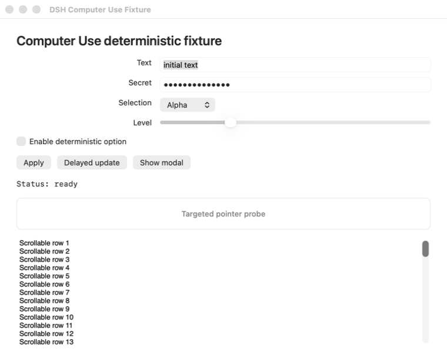
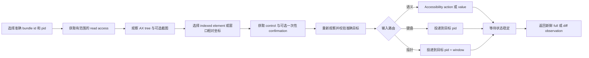

# DSH Computer Use

[](LICENSE)


**为 DeepSeek Harness 提供原生 macOS 控制能力，默认不碰你的真实光标，也不抢占前台应用。**

DSH Computer Use 为 Agent 提供新鲜的 Accessibility observation、准确进程/窗口定向、stale state 拒绝、按应用限制的访问，以及动作后的可验证状态。语义化 Accessibility 始终优先；鼠标、拖拽、滚轮与键盘 fallback 会投递给选定进程，而不是全局桌面。

[English](README.md) | 中文

## 为什么它不同

Accessibility 权限允许进程读取和操作 macOS UI 元素，但这个权限本身并不会自动防止抢焦点或移动光标。是否干扰用户，取决于输入事件走哪条路由。

DSH Computer Use 的默认路由有意避免干扰：

- **不移动系统光标：** helper 中没有 cursor warp 路径。
- **不做全局指针注入：** click、scroll 与 drag fallback 使用 pid/window 定向的 SkyLight 路由，不进入全局 HID 事件流。
- **默认不激活应用：** 语义化 Accessibility、进程定向键盘输入与目标进程指针输入都使用 `focusPolicy: preserve`。
- **不盲目重放：** 每个动作都绑定准确、未过期的 observation，并返回新鲜状态。

因此，这个原生动作层可以在用户继续使用当前前台应用时，操作许多后台应用。

## 它补充了什么

- **先观察再动作。** 返回有界 Accessibility tree、带 index 的元素、准确 app/process/window metadata、权限状态和可选截图 Artifact。
- **把动作绑定到状态。** 每个元素 index 只属于一个 opaque `observationId`；进程、窗口、locator 或目标身份变化都会 fail closed。
- **优先语义输入。** 先使用 `AXPress`、可编辑 value、selected-text 赋值和元素声明的 Accessibility action，再考虑指针 fallback。
- **把 fallback 投递给目标。** 键盘输入发给选定 pid；指针输入携带窗口本地坐标，发给选定 pid 和 `CGWindowID`。
- **返回新鲜证据。** 每个成功动作都会经过有界 settle，并返回新的完整或差分 observation。
- **按应用限制访问。** read/control lease 按 Agent、Session、turn 与准确 bundle id 分离；高影响动作另需一次性确认。
- **保持模型表面聚焦。** 只有当前 Agent 加载 Computer Use Skill 后才暴露执行 Tool。

## 证据：从未激活的后台 fixture

仓库包含确定性 AppKit fixture 和 universal native helper。发布测试会通过 `open -g` 以后台模式启动 fixture，再通过 Agent 使用的同一协议完成操作。

```text
observe exact bundle id + pid
-> element: "Targeted pointer probe", no AXPress action
-> 使用 observationId + element index + allowCoordinateFallback 执行 computer_click
-> fresh observation
-> activation "not-requested"; pointerRouting "target-process"
-> status "Status: pointer click"
```

<p align="center">
  
</p>

Fixture 会记录每次 `applicationDidBecomeActive` 回调。独立 native monitor 还会在 click、scroll 与 drag 整个动作期间每毫秒采样系统光标和前台 pid。默认发布路径要求 `activationCount: 0`、光标坐标不变、前台 pid 不变、click/scroll 精确计数，并且 drag 只有一组完整 down/up gesture。

需求、架构、关键决策、验证证据和兼容性边界见[前台安全输入策略](docs/interaction-policy.zh.md)。

## 范围

`dsh-computer-use` 是原生**动作层**，不会取代更窄的接口：

- 浏览器任务应继续使用 browser automation 和 DOM/CDP 状态；
- 有 API、CLI 或专用应用插件时仍应优先使用；
- OCR、视觉 grounding 与像素理解可以来自独立安装的 `dsh-vision-toolkit`；
- `dsh-design` 等领域 Bundle 可以在工作流跨入原生应用时组合 Computer Use。

## 快速开始

### 前置条件

- macOS 14 或更新版本。
- 已安装 Web 或 Headless Profile、并挂载 Skill Tool 的 DeepSeek Harness。
- 用于观察和原生动作的 macOS Accessibility 权限。
- 只有请求截图时才需要 macOS Screen Recording 权限。
- 构建本仓库时需要 Node.js `^22.19.0` 或 `>=24.0.0`。

软件包当前尚未发布到 npm，请从 checkout 安装：

```sh
git clone https://github.com/dsh-external/dsh-computer-use.git
PLUGIN="$PWD/dsh-computer-use"

dsh plugin --profile web add "$PLUGIN"
dsh plugin --profile headless add "$PLUGIN"

dsh --profile web --dump-config | grep computer-use
dsh --profile headless --dump-config | grep computer-use
```

修改已安装插件后，需要重启正在运行的 `dsh web` host，再创建一个新 Session，让 host 重新载入 Bundle 与 Skill catalog。

在新 Session 中加载 Skill：

```text
/computer-use
```

然后可以尝试：

> 使用 Computer Use 检查正在运行的 DSH Computer Use Fixture，启用 deterministic option，并根据动作后返回的新状态报告结果。优先使用 Accessibility 元素，不要复用旧 observation。

## 工作原理



每个元素 index 只在来源 observation 中有效。元素动作可以容忍无关 tree 变化，但会拒绝变化的进程、窗口、locator 或目标身份。坐标动作要求引用窗口的完整状态仍然新鲜。Stale 动作会返回 `COMPUTER_STALE_OBSERVATION`，不会搜索相似替代目标。

默认 interaction policy 为：

```yaml
interaction:
  focusPolicy: preserve
  pointerInputPolicy: targeted
```

`pointerInputPolicy: deny` 会禁用坐标点击/fallback、滚动与拖拽。`focusPolicy: activate` 是显式兼容模式，可能把目标应用带到前台；激活后 helper 会重新观察并校验准确目标，之后才发出输入。

Helper executable 是 DSH 内部传输实现，不是公共授权 API。它要求独立进程组和父进程持有的标准传输，因此普通 shell 重定向会在解析命令前 fail closed。这个检查只属于纵深防御，不会认证同一 macOS 用户下运行的任意代码：专门构造的 detached 父进程仍能复现这类传输拓扑。应通过已注册 Tool 使用该能力，以保留应用 lease、敏感动作 confirmation 与宿主策略检查；不能把 `danger-full-access` 当作阻止直接 native 调用的保护。

成功动作结果包括：

```ts
activation: 'not-requested' | 'already-frontmost' | 'activated'
pointerInput: boolean
pointerRouting: 'none' | 'target-process'
```

模型不能通过 Tool 参数覆盖这些宿主策略。

## 模型 Tool

Bundle 初始只贡献 `computer_use_activate`。加载 Skill 后，才为当前 Agent 暴露聚焦的执行 vocabulary。

<details>
<summary>查看完整 Tool 列表</summary>

| Tool | 用途 |
|---|---|
| `computer_list_apps` | 列出有界用户应用及 bundle id、pid、前台状态和权限诊断 |
| `computer_observe` | 返回新鲜的 full/diff Accessibility observation 与可选截图 Artifact |
| `computer_click` | 优先使用 `AXPress`；也可通过目标进程指针输入点击已观察元素 frame 或窗口坐标 |
| `computer_set_value` | 不使用剪贴板，设置或清空可编辑 Accessibility value |
| `computer_type_text` | 支持时通过 Accessibility 插入 Unicode，否则使用进程定向键盘 fallback |
| `computer_press_key` | 向选定进程发送有限词表中的按键，并支持可选 modifier |
| `computer_scroll` | 向选定进程与窗口发送有界方向滚动 |
| `computer_drag` | 在引用 observation 的窗口空间内拖拽 |
| `computer_perform_action` | 执行选定元素声明的准确 Accessibility action |
| `computer_wait` | 轮询一个有界 text/role/title 条件，不修改应用并返回新鲜状态 |
| `computer_confirm` | 获取绑定准确敏感动作的一次性 token |

任何 Tool 都不接受 AppleScript、JXA、shell、Swift、Objective-C、native selector、任意 Accessibility constant 或源码。

</details>

## Observation、权限与敏感动作

Observation 包含 opaque id 与过期时间、准确 app 身份、frontmost/window metadata、有界 tree text、当前 indexed element、可选截图 metadata 和权限状态。Secure text value 以 `[secure]` 输出，不会进入 tree text、Tool result、截图 metadata 或 native error。截图仍可能包含应用中其他可见数据，应按敏感数据处理。

技术访问模型包含两类准确 bundle-id lease：

- `read`：读取 Accessibility 状态和请求的截图；
- `control`：向选定应用发送 UI 输入。

没有配置 grant 时，DSH 会请求 approval。Read approval 在 Session 内有效，control approval 只在当前 turn 有效。用户拒绝后，该 app/scope 在当前 Session 内保持最终结果。

DSH `danger-full-access` preset 使用 `approval/policy: never`，因此未授权应用会在弹窗前被策略阻断。插件返回可操作的 `COMPUTER_PERMISSION_REQUIRED` 错误，并且不会把它记录成用户拒绝。请在 Computer Use Settings 中添加准确 bundle id，或改用 approval policy 为 `ask` 的 preset。

高影响外部通信、敏感数据传输、不可逆删除、账户/安全/隐私变更、未经请求的安装、法律条款接受，以及超出明确授权的财务完成动作，都需要在执行前立即调用 `computer_confirm`。Token 有短 TTL、只能使用一次，并绑定准确 app、process、observation 与 action；grant 不能绕过它。

## macOS 权限与 native 完整性

Web Settings 分区展示 helper 完整性、Accessibility 与 Screen Recording 状态、当前 generation、interaction policy、限制和准确应用 grant。只有用户点击后，按钮才会打开相关 macOS 隐私页面；插件不能自行授予 TCC 权限。

Accessibility 与 Screen Recording 是 UI 权限，不是文件系统权限。正常使用保持在 DSH `workspace-write` 下：截图留在 Session workspace，临时文件使用 Session 私有临时目录，Bundle 不要求 `danger-full-access`。

仓库提交的 helper 是最低支持 macOS 14、ad-hoc 签名的 `arm64` + `x86_64` universal binary。[`native/macos/manifest.json`](native/macos/manifest.json) 固定其 SHA-256、源码 digest、架构与 deployment target。`pnpm run check:native` 还会检查只有目标进程指针路由，并拒绝系统光标 warp 或全局指针 post symbol。

## 配置

<details>
<summary>查看 Bundle 配置字段</summary>

| 字段 | 用途 |
|---|---|
| `observationTtlMs` | observation 允许复用的生命周期 |
| `confirmationTtlMs` | 一次性敏感动作 confirmation 的生命周期 |
| `actionTimeoutMs` | `1000` 到 `120000` ms 的 native action 硬超时 |
| `settleMs` | `0` 到 `10000` ms 的动作后状态检查间隔 |
| `maxSettleMs` | `100` 到 `60000` ms 的动作后 settle 最大预算 |
| `maxNodes` / `maxDepth` / `maxTextBytes` | Accessibility 遍历与模型可见文本上限 |
| `maxScreenshotBytes` | PNG Artifact 最大字节数 |
| `artifactRoot` | workspace 内的相对截图目录 |
| `helper.path` | 可选的显式外部 helper executable |
| `helper.allowSourceBuild` | 提交 helper 缺失时允许显式托管源码重建；默认 `false` |
| `interaction.focusPolicy` | `preserve`（默认）避免激活目标应用；`activate` 显式允许激活，并要求重新观察/校验 |
| `interaction.pointerInputPolicy` | `targeted`（默认）允许 pid/window 定向指针输入；`deny` 禁用 click fallback、scroll 和 drag |
| `grants` | 准确、无通配符的 bundle-id read/control policy；`control: true` 隐含 read |

</details>

Settings 更新只有在校验与健康检查通过后才替换当前 provider generation；替换会使已有 observation 与待用 confirmation 失效。

## 状态与限制

- 状态：早期 `0.1.0`；稳定版本发布前，模型可见和 provider 行为仍可能变化。
- 当前 provider 只支持 macOS；Windows UI Automation 和 Linux provider 尚未实现。
- 目标进程指针投递使用动态解析的 SkyLight SPI。该路由不可用时，pointer fallback 会 fail closed，不会切换到全局输入。
- Pointer fallback 需要一个能唯一识别的屏幕内窗口。最小化、隐藏、有歧义或无窗口目标会 fail closed。
- 自定义 canvas、游戏、强化输入 surface 与未来 macOS 版本可能拒绝目标进程指针或键盘事件。应尽量优先使用语义化 Accessibility。
- `focusPolicy: activate` 会有意打断前台工作，只作为操作方显式选择的兼容模式。
- 目标应用可能因接受动作而自行改变 activation 或 focus。
- 软件包按请求捕获离散 observation，不提供实时桌面流。
- 浏览器工作应继续使用 browser automation，因为 DOM/CDP 状态更窄、更精确。
- npm 软件包名已写入 metadata，但尚未发布；请从 checkout 或本地 tarball 安装。

## 开发与发布验收

请把仓库放在 DeepSeek Harness checkout 旁边，让 TypeScript 与 Vitest 解析准确的 DSH peer declaration 和 runtime module：

```text
workspace/
├── packages/
├── vendor/
└── dsh-computer-use/
```

随后运行：

```sh
pnpm install --frozen-lockfile
pnpm run build
DSH_COMPUTER_USE_REQUIRE_TCC=1 pnpm test
pnpm run check:native
pnpm pack --dry-run
pnpm run validate
```

`pnpm run validate` 会运行 keyless local lane 和干净 Web/Headless Profile lane。真实模型发布 lane 需要 `DEEPSEEK_API_KEY`，并支持可选的 `DEEPSEEK_BASE_URL`：

```sh
pnpm run validate:model
# 或先执行 keyless 验证，再执行真实模型 lane
pnpm run validate:release
```

## 移除

```sh
dsh plugin --profile web remove @dsh-external/dsh-computer-use
dsh plugin --profile headless remove @dsh-external/dsh-computer-use
```

移除或禁用 Bundle 会注销 Skill 与 Tool、取消 helper 工作、释放 Agent observation 与 confirmation，并移除 Web contribution。已经生成的截图文件留在 Session workspace，供用户显式清理。

## 安全、社区与支持

- 潜在漏洞按 [SECURITY.md](SECURITY.md) 私下报告。
- 修改代码或文档前请阅读 [CONTRIBUTING.md](CONTRIBUTING.md)。
- 安装、权限、配置和工作流问题见 [SUPPORT.md](SUPPORT.md)。
- 在项目空间中遵守 [Code of Conduct](CODE_OF_CONDUCT.md)。
- 版本记录见 [CHANGELOG.md](CHANGELOG.md)。
- 维护支持方式见 [FUNDING.md](FUNDING.md)，赞助不购买 roadmap 控制权或私有支持。

## 许可证

[MIT](LICENSE) © 2026 anionex。
