# DSH Computer Use

[](LICENSE)


**给 DeepSeek Harness 增加基于新鲜 Accessibility 状态的原生 macOS 动作层，而不是盲点桌面坐标。**

DSH Computer Use 让 Agent 识别准确的运行应用、读取当前 UI 结构、把动作绑定到一个可回放 observation、拒绝陈旧目标、获取有 scope 的访问权限，并返回动作后的新状态。它是 DSH capability bundle，不是另一套 Agent runtime 或远程桌面产品。

[English](README.md) | 中文

## 为什么需要它

Shell Tool 可以启动应用，Browser Tool 可以操作网页，但两者都没有提供通用原生 macOS UI 协议。可靠的桌面 Agent 需要的不只是 `click(x, y)`：它必须知道正在控制哪个进程和窗口，优先使用语义控件而不是坐标，避免把动作重放到已变化的状态，保护 secure value，请求正确访问权限，并验证动作结果。

DSH Computer Use 用一个 DSH Service、原生 macOS provider、可移植 Skill、按 Agent 渐进暴露的模型 Tool、截图 Artifact 和 Web Settings 表面补齐动作层。领域工作流可以在任务跨入原生应用时组合它；浏览器和 API 任务继续使用更窄的能力。

## 它补充了什么

- **先观察再动作：**返回有界 Accessibility tree、带 index 的元素、准确 app/process/window metadata、权限状态和可选截图 Artifact。
- **把动作绑定到状态：**每个元素 index 只属于一个 opaque `observationId`；修改型 Tool 会拒绝变化的进程、窗口、locator 或目标身份，不会猜测替代目标。
- **优先语义输入：**先使用 `AXPress`、可编辑 value 和元素声明的 Accessibility action，只有显式允许时才回退到 observation 窗口内坐标。
- **返回新鲜证据：**每个成功动作都经过有界 settle，并返回新的完整或差分 observation。
- **按应用限制访问：**read/control lease 绑定 Agent、Session、turn 和准确 bundle id；敏感动作另需一次性确认。
- **保持模型表面聚焦：**只有当前 Agent 加载 Computer Use Skill 后才暴露执行 Tool vocabulary。

## 证据：一次绑定 observation 的原生动作

仓库包含确定性 AppKit fixture 和 universal native helper。真实 fixture 测试与发布 runner 会发现准确进程、读取 Accessibility 状态、通过 observation 中的元素执行动作，并要求返回的新状态确认结果。

仓库中的证据状态通过 Agent 使用的同一协议生成：

```text
observe exact bundle id + pid
-> element 10: "Enable deterministic option", value 0
-> click using observationId + element index
-> fresh observation
-> checkbox value 1; status "Status: option enabled"
```

<p align="center">
  
</p>

fixture 还覆盖应用发现、截图、Accessibility click/value/action、不替换剪贴板的 Unicode 输入、按键、滚动、拖动、延迟状态、stale observation 拒绝、secure field 脱敏和进程终止。该截图是离散测试 Artifact，不是连续桌面流。

## 产品定位

```text
dsh-vision-toolkit   visual facts, OCR, grounding, and pixel evidence
dsh-computer-use     native application observation and bounded UI actions
```

DSH Computer Use 是可复用的**动作层**。它不实现视觉模型、设计工作流、浏览器协议、远程桌面流或替代桌面 shell。

## 快速开始

### 前置条件

- macOS 14 或更高版本。
- DeepSeek Harness Web 或 Headless Profile，并挂载 Skill Tool。
- 构建仓库时使用 Node.js `^22.19.0` 或 `>=24.0.0`。
- 结构观察和 UI 动作需要 macOS Accessibility 权限。
- 只有请求截图时才需要 macOS Screen Recording 权限。

软件包目前尚未发布到 npm，请从 checkout 安装：

```sh
git clone https://github.com/dsh-external/dsh-computer-use.git
PLUGIN="$PWD/dsh-computer-use"

dsh plugin --profile web add "$PLUGIN"
dsh plugin --profile headless add "$PLUGIN"

dsh --profile web --dump-config | grep computer-use
dsh --profile headless --dump-config | grep computer-use
```

在带 Skill Tool 的 Session 中加载 Computer Use：

```text
/computer-use
```

Skill 只为当前 Agent 激活聚焦执行 schema。适合作为首次验证的请求：

> 使用 Computer Use 检查正在运行的 DSH Computer Use Fixture，启用 deterministic option，并根据动作后返回的新状态报告结果。优先使用 Accessibility 元素，不要复用旧 observation。

## 工作原理

```mermaid
flowchart LR
    A[Select exact bundle id and pid] --> B[Acquire scoped read access]
    B --> C[Observe AX tree and optional screenshot]
    C --> D[Choose indexed element or observed-window point]
    D --> E[Acquire control and optional one-use confirmation]
    E --> F[Rebuild and validate current target]
    F --> G[Send bounded native input]
    G --> H[Wait for settlement]
    H --> I[Return fresh full or diff observation]
```



每个元素 index 只在产生它的 observation 中有效。元素动作容忍无关 tree 更新，但会拒绝变化的进程、window、locator 或目标身份。坐标和依赖 focus 的动作要求完整 observation 状态仍然新鲜。陈旧操作以 `COMPUTER_STALE_OBSERVATION` 失败，不会搜索“差不多”的替代元素。

## 模型 Tool

部署初始只贡献 `computer_use_activate`。Agent 加载内置 Skill 后，才获得以下聚焦 Tool。

<details>
<summary>查看完整 Tool vocabulary</summary>

| Tool | 用途 |
|---|---|
| `computer_list_apps` | 列出有界的用户应用，包括 bundle id、pid、frontmost 和权限诊断 |
| `computer_observe` | 返回新的完整/差分 Accessibility observation 和可选截图 Artifact |
| `computer_click` | 优先执行 `AXPress`；可显式点击已观察元素 frame 或 observation 窗口内坐标 |
| `computer_set_value` | 设置或清空可编辑 Accessibility value，不使用剪贴板 |
| `computer_type_text` | 支持时通过 Accessibility 插入 Unicode，否则使用定向到准确进程的键盘 fallback |
| `computer_press_key` | 从有限 vocabulary 发送一个按键和可选 command/control/option/shift modifier |
| `computer_scroll` | 在已观察元素或坐标处发送有界方向滚动 |
| `computer_drag` | 在引用 observation 的窗口坐标空间内拖动 |
| `computer_perform_action` | 执行选中元素明确声明的一个 Accessibility action |
| `computer_wait` | 轮询一个有界 text/role/title 条件并返回新状态，不修改应用 |
| `computer_confirm` | 获取绑定一个准确敏感动作的一次性 token |

没有 Tool 接受 AppleScript、JXA、shell、Swift、Objective-C、native selector、任意 Accessibility constant 或源码。

</details>

## Observation 模型

一个 observation 包含：

- opaque `observationId`、创建时间和过期时间；
- 准确应用 `bundleId`、当前 `pid` 和名称；
- frontmost 和当前窗口 metadata；
- 有界 Accessibility tree text；
- 当前带 index 的元素，包括 role、label、脱敏 value、state、frame 和声明的 action；
- 可选截图 Artifact 的尺寸和文件 metadata；
- Accessibility 与 Screen Recording 状态。

一个 Agent/application 对的首个 observation 是完整状态；后续可以返回 diff，其中 index 始终指向本次返回的新状态。上下文 compact 后或需要完整 tree 时，请请求 `full: true`。

Secure text value 以 `[secure]` 输出，不会进入 tree text、Tool result、截图 metadata 或 native error。请求的截图仍可能包含应用界面中可见的其他数据，因此截图访问同样有 scope，也应按敏感数据处理。

## 权限与敏感动作

技术访问模型包含两类应用 lease：

- **read：**读取 Accessibility 状态和请求的截图；
- **control：**向选定应用发送 UI 输入。

没有预配置 grant 时，插件通过 DSH approval 询问用户。Read approval 在 Session 内有效，control approval 只在当前 turn 有效；两者都绑定准确 Agent 和 bundle id。Headless 环境没有 approval answerer 时会 fail closed。

高影响外部通信、发送敏感数据、不可逆删除、账号/安全/隐私变更、未请求安装、法律接受，以及超出用户明确授权的金融完成，还需要紧邻执行的一次语义确认。`computer_confirm` 返回绑定准确 app、process、observation 和 action field 的短时一次性 token。配置 grant 不能绕过该确认。

## macOS 权限

Web Settings 分区展示 helper 完整性、Accessibility 状态、Screen Recording 状态、当前 generation、限制和准确的按应用 grant。只有用户点击后，按钮才会打开相关 macOS 隐私页面；插件不能自行授予 TCC 权限。

缺少权限时：

1. 打开 DSH Settings → Computer Use。
2. 对 Accessibility 或 Screen Recording 使用 **Open macOS Settings**。
3. 按 macOS 显示的当前 DSH host/helper 启动身份授予权限。
4. 如果 macOS 要求，重启相应 host，然后使用 **Refresh health**。

`computer_observe` 和原生动作需要 Accessibility。`screenshot: "optional"` 没有 Screen Recording 时可以省略截图；`screenshot: "required"` 则会明确失败。

TCC grant 是 UI 权限，不是文件系统权限。正常使用保持在 DSH `workspace-write` 下：截图 Artifact 留在 Session workspace，插件临时文件使用 Session 私有临时存储，Bundle 不要求 `danger-full-access`。

## Native helper 完整性

仓库提交的 helper 是最低支持 macOS 14、ad-hoc 签名的 `arm64` + `x86_64` universal binary。其 SHA-256、源码 digest、架构和 deployment target 固定在 [`native/macos/manifest.json`](native/macos/manifest.json)，源码位于 `native/macos/Sources/Helper/`。

外部 helper 路径必须是可执行普通文件，不能是符号链接。托管 helper 必须匹配提交的 manifest hash。软件包归档移除 execute bit 时，provider 会先校验文件身份和 hash，再只恢复 owner execute 权限。

## 配置

<details>
<summary>Bundle 配置字段</summary>

| 字段 | 用途 |
|---|---|
| `observationTtlMs` | observation 允许复用的生命周期 |
| `actionTimeoutMs` | `1000` 到 `120000` ms 的 native action 硬超时 |
| `settleMs` | `0` 到 `10000` ms 的动作后状态检查间隔 |
| `maxSettleMs` | `100` 到 `60000` ms 的动作后 settle 最大预算 |
| `maxNodes` / `maxDepth` / `maxTextBytes` | Accessibility 遍历与模型可见文本上限 |
| `maxScreenshotBytes` | PNG Artifact 最大字节数 |
| `artifactRoot` | workspace 内的相对截图目录 |
| `helper.path` | 可选的显式外部 helper executable |
| `helper.allowSourceBuild` | 提交 helper 缺失时允许显式托管源码重建；默认 `false` |
| `grants` | 准确、无通配符的 bundle-id read/control policy；`control: true` 隐含 read |

</details>

Settings 更新按 generation 生效。候选 helper 和配置必须先通过校验与健康检查，才能替换当前 generation；替换会使已有 observation 和待用 confirmation 失效。

## 稳定错误码

<details>
<summary>查看恢复方式</summary>

| Code | 正确下一步 |
|---|---|
| `COMPUTER_UNSUPPORTED_PLATFORM` | 使用受支持 provider 或其他能力 |
| `COMPUTER_PERMISSION_REQUIRED` | 授予指定 macOS 权限或 DSH 应用 lease |
| `COMPUTER_APP_NOT_FOUND` | 列出应用并选择准确 bundle id 和 pid |
| `COMPUTER_STALE_OBSERVATION` | 重新观察并重新选择目标 |
| `COMPUTER_ELEMENT_UNAVAILABLE` | 使用元素声明的 action 或显式坐标 fallback |
| `COMPUTER_TARGET_UNAVAILABLE` | 使用更窄能力、视觉 grounding，或询问用户 |
| `COMPUTER_CONFIRMATION_REQUIRED` | 紧邻执行前确认准确拟执行动作 |
| `COMPUTER_ACTION_BLOCKED` | 检查新状态并选择其他受支持动作 |
| `COMPUTER_TIMEOUT` | 检查当前状态；只有安全时才重试 |
| `COMPUTER_CANCELLED` | 停止或重新评估任务 |
| `COMPUTER_PROVIDER_FAILURE` | 检查有界诊断，不能推断动作成功 |

</details>

## Web 与 Headless 行为

- **Web：**通过 `dsh.client` 贡献 Settings 分区，管理健康、限制、helper 选择和准确 bundle-id grant。Tool 输出使用通用 card 和截图 Artifact metadata，不提供连续桌面流。
- **Headless：**暴露相同 Skill、Tool、observation 语义、错误和 Artifact。缺少交互 approval 时返回稳定权限或确认错误，不会静默允许控制。

## 状态与限制

- **状态：**早期 `0.1.0`；稳定版本发布前，模型可见和 provider 行为仍可能变化。
- 当前 provider 只支持 macOS；Windows UI Automation 和 Linux provider 尚未实现。
- Accessibility 质量取决于目标应用；自定义 canvas 可能暴露不完整结构，需要截图/视觉 fallback。
- 浏览器工作应继续使用 browser automation，因为 DOM/CDP 状态更窄、更精确。
- 软件包按请求捕获离散 observation，不提供实时桌面流。
- 坐标动作受限于引用 observation 的窗口，但可靠性仍低于 Accessibility action。
- 应用 lease 只建立技术访问，不能完成业务影响分类；后者由 Skill 和一次性确认协议处理。
- npm 软件包名已写入 metadata，但当前尚未发布；请从 checkout 或本地 tarball 安装。

## 开发与验收

请把仓库放在 DeepSeek Harness checkout 旁边，让 TypeScript 和 Vitest 使用准确的 DSH peer declaration 和 runtime module：

```text
workspace/
├── packages/
├── vendor/
└── dsh-computer-use/
```

随后运行：

```sh
pnpm install --frozen-lockfile
pnpm run build
DSH_COMPUTER_USE_REQUIRE_TCC=1 pnpm test
pnpm pack --dry-run
pnpm run validate
```

`pnpm run build` 会编译并 ad-hoc 签名 universal helper、构建确定性 fixture app、生成 ESM runtime 和类型，并产出 loader-compatible Web client。`pnpm run validate` 还覆盖 native 完整性、软件包、干净 Profile、渐进暴露、生命周期，以及 `workspace-write` 下的真实 fixture 操作。

真实模型 lane 需要 `DEEPSEEK_API_KEY`，并支持可选的 `DEEPSEEK_BASE_URL`：

```sh
pnpm run validate:model
# or deterministic plus real-model validation
pnpm run validate:release
```

干净独立 checkout 可以运行 `pnpm exec vitest run tests/package-layout.spec.ts` 和 `pnpm run check:native`。完整 TypeScript build、干净 DSH Profile、强制 TCC 的原生动作和真实模型 lane 仍是发布检查，因为它们需要同级 DSH 源码树、macOS 权限或凭据。

## 移除

```sh
dsh plugin --profile web remove @dsh-external/dsh-computer-use
dsh plugin --profile headless remove @dsh-external/dsh-computer-use
```

移除或禁用 Bundle 会注销 Skill 和 Tool、取消在途 helper 工作、释放 Agent observation 与 confirmation，并移除 Web route/client contribution。已经生成的截图文件留在 Session workspace，供用户显式清理。

## 安全、社区与支持

- 发现潜在漏洞时按 [SECURITY.md](SECURITY.md) 私下报告。
- 提交代码或文档变更前先阅读 [CONTRIBUTING.md](CONTRIBUTING.md)。
- 按 [SUPPORT.md](SUPPORT.md) 选择正确支持渠道，并提供可操作诊断信息。
- 在所有项目空间遵守 [Code of Conduct](CODE_OF_CONDUCT.md)。
- 在 [CHANGELOG.md](CHANGELOG.md) 查看版本记录。
- 如果希望支持维护但不购买 roadmap 控制权或私有支持，请阅读 [FUNDING.md](FUNDING.md)。

## 许可证

[MIT](LICENSE) © 2026 anionex。
